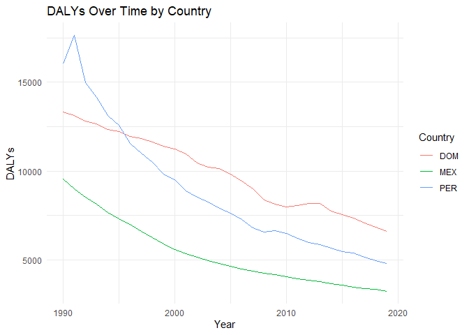
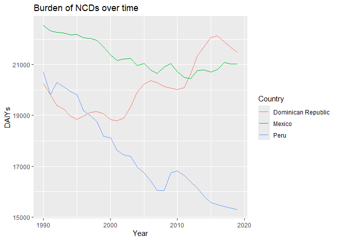

Global Disease Burden Analysis
================
Jessica Zafra, Massiel Sepulveda

# Introduction

This document compares the Disability-Adjusted Life Year (DALY) diseases
burden for three countries: Dominican Republic, Mexico, and Peru. We
compare the burden due to communicable, maternal, neonatal, and
nutritional diseases (CMNN), non-communicable diseases (NCDs), and
overall disease burden for these countries.

The source data is from the Institute for Health Metrics and Evaluation
(IHME) Global Burden of Disease (GBD) study.

# Communicable, Maternal, Neonatal, and Nutritional Disease Burden (CMNN)

## Table of Estimates for CMNN Burden Over Time

| Year |       DOM |      MEX |       PER |
|-----:|----------:|---------:|----------:|
| 1990 | 13324.751 | 9556.953 | 16031.566 |
| 1991 | 13146.868 | 9019.454 | 17627.373 |
| 1992 | 12813.481 | 8550.553 | 14983.845 |
| 1993 | 12662.976 | 8126.727 | 14137.367 |
| 1994 | 12362.544 | 7676.243 | 13120.092 |
| 1995 | 12226.849 | 7334.997 | 12571.486 |
| 1996 | 11969.138 | 6988.380 | 11571.448 |
| 1997 | 11847.337 | 6616.230 | 10990.470 |
| 1998 | 11619.116 | 6251.836 | 10497.697 |
| 1999 | 11412.832 | 5908.323 |  9837.913 |
| 2000 | 11235.057 | 5584.335 |  9506.864 |
| 2001 | 10959.717 | 5335.682 |  8895.340 |
| 2002 | 10450.281 | 5146.172 |  8527.006 |
| 2003 | 10205.846 | 4974.931 |  8260.737 |
| 2004 | 10151.974 | 4787.616 |  7901.332 |
| 2005 |  9845.067 | 4646.049 |  7633.481 |
| 2006 |  9446.605 | 4478.685 |  7275.262 |
| 2007 |  9008.202 | 4355.398 |  6820.255 |
| 2008 |  8377.506 | 4271.180 |  6585.006 |
| 2009 |  8128.912 | 4189.551 |  6636.337 |
| 2010 |  7989.195 | 4052.977 |  6481.460 |
| 2011 |  8074.392 | 3941.285 |  6203.510 |
| 2012 |  8198.438 | 3846.740 |  5994.907 |
| 2013 |  8170.433 | 3773.981 |  5864.862 |
| 2014 |  7765.228 | 3677.438 |  5685.244 |
| 2015 |  7564.519 | 3576.541 |  5473.612 |
| 2016 |  7354.619 | 3469.553 |  5376.417 |
| 2017 |  7094.939 | 3399.685 |  5141.751 |
| 2018 |  6845.975 | 3334.861 |  4967.296 |
| 2019 |  6624.667 | 3246.791 |  4802.782 |

## Plot Showing Trends in CMNN Burden Over Time

<!-- -->

## Summary of CMNN Burden Findings

These data show the burden due to communicable, maternal, neonatal, and
nutritional diseases (CMNN) for Dominican Republic (DOM), Mexico (MEX),
and Peru (PER). We can see that overall, the DALYs over time for all
three countries have been steadily dropping from 1990 to 2020. Peru, in
particular, started with the highest DALYs in 1990 and, as of 2020, has
dropped down to second place, behind the Dominican Republic.

# Non-Communicable Disease Burden (NCD)

## Table of Estimates for NCD Burden Over Time

| year |      DOM |      MEX |      PER |
|-----:|---------:|---------:|---------:|
| 1990 | 20255.61 | 22537.01 | 20704.24 |
| 1991 | 19825.07 | 22329.99 | 19826.77 |
| 1992 | 19380.05 | 22260.66 | 20300.90 |
| 1993 | 19272.71 | 22256.58 | 20138.03 |
| 1994 | 18961.59 | 22176.27 | 19928.45 |
| 1995 | 18859.72 | 22186.60 | 19823.32 |
| 1996 | 18975.81 | 22049.21 | 19192.60 |
| 1997 | 19135.24 | 22027.22 | 18981.46 |
| 1998 | 19142.89 | 21956.94 | 18760.35 |
| 1999 | 19071.42 | 21688.58 | 18181.21 |
| 2000 | 18840.73 | 21374.95 | 18124.39 |
| 2001 | 18802.02 | 21172.42 | 17633.24 |
| 2002 | 18892.14 | 21218.73 | 17441.95 |
| 2003 | 19319.08 | 21235.68 | 17395.94 |
| 2004 | 19912.77 | 20959.42 | 16983.02 |
| 2005 | 20238.80 | 21051.60 | 16736.27 |
| 2006 | 20378.13 | 20786.44 | 16423.56 |
| 2007 | 20301.66 | 20643.53 | 16045.44 |
| 2008 | 20129.30 | 20912.38 | 16040.21 |
| 2009 | 20082.15 | 21046.65 | 16743.19 |
| 2010 | 20012.31 | 20727.01 | 16812.84 |
| 2011 | 20101.03 | 20488.73 | 16634.51 |
| 2012 | 20651.55 | 20460.09 | 16391.05 |
| 2013 | 21348.41 | 20763.36 | 16146.03 |
| 2014 | 21719.64 | 20788.63 | 15805.54 |
| 2015 | 22078.41 | 20715.05 | 15579.31 |
| 2016 | 22139.33 | 20807.49 | 15501.01 |
| 2017 | 21896.81 | 21077.82 | 15407.11 |
| 2018 | 21666.91 | 21024.09 | 15353.10 |
| 2019 | 21486.58 | 21022.82 | 15303.04 |

## Plot Showing Trends in NCD Burden Over Time

<!-- -->

## Summary of NCD Burden Findings

3 chosen from the Latin America and Caribean Region were chosen:
Dominican Republic, Mexico and Peru.

The trend of NCD burden in Peru seems to be declining, while the one for
Dominican Republic increases over time.

In the case of Mexico, there has been a slow decline that has become
slower in recent years.

# Overall Disease Burden

## Table of Estimates for Overall Disease Burden Over Time

## Plot Showing Trends in Overall Disease Burden Over Time

## Summary of Overall Disease Burden Findings

Provide a brief analysis based on the data presented in the table and
chart. Highlight any significant findings or patterns. About 3
sentences.
